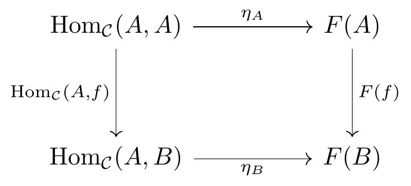

# quiver-to-image

Convert [quiver](https://q.uiver.app) commutative diagrams (tikz-cd) to SVG and PNG using Docker.

## Demo

Copy a diagram from quiver, run:

```
$ uv run python -m quiver_to_image my-diagram

Done:
  SVG: ~/quiver-diagrams/my-diagram.svg
  PNG: ~/quiver-diagrams/my-diagram.png
```

Result:



## Prerequisites

- Python 3.10+
- [uv](https://docs.astral.sh/uv/)
- Docker

## Install

```sh
git clone <repo>
cd quiver-to-image
docker build -t quiver-render .
uv sync
```

## Usage

**Clipboard mode** (default) — copy tikz-cd code from quiver, then:

```sh
uv run python -m quiver_to_image [name] [-o DIR]
```

**Pipe mode** — read from stdin:

```sh
cat example-code | uv run python -m quiver_to_image --no-clipboard
```

## CLI

| Argument/Option | Description |
|---|---|
| `name` | Output filename (default: `diagram-<timestamp>`) |
| `-o, --output DIR` | Output directory (default: `~/quiver-diagrams`) |
| `-n, --no-clipboard` | Read LaTeX from stdin instead of clipboard |

## How it works

1. Read tikz-cd LaTeX from clipboard or stdin
2. Wrap in standalone document with `\usepackage{quiver}`
3. Compile inside Docker: `pdflatex` → `pdf2svg` + `pdftoppm`
4. Save SVG and PNG to output directory

## Example

Input (tikz-cd from quiver):

```latex
\begin{tikzcd}
    A \arrow[r, "f"] \arrow[d, "g"'] & B \arrow[d, "h"] \\
    C \arrow[r, "k"'] & D
\end{tikzcd}
```

Output:


